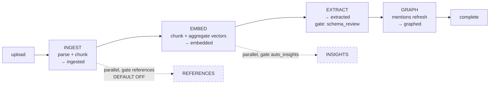
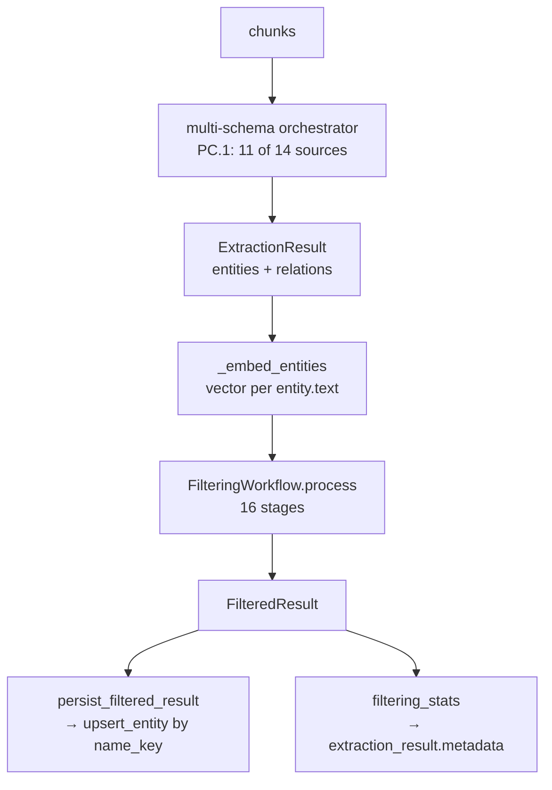
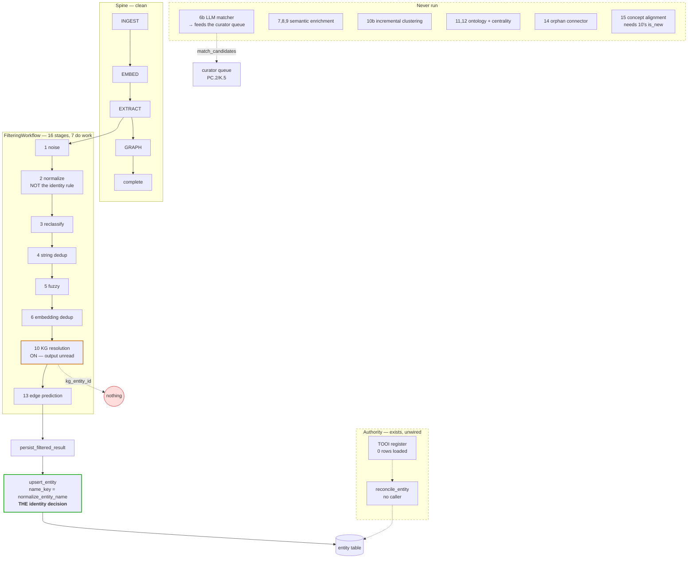

# The ingestion pipeline as it is actually wired

*Derived from the code on 2026-09-05 at `d17ca025`, not from the design docs.
Every "on/off" below is read from a config default or an env toggle, and every
"consumer" from a search of the production tree.*

## 1. The top-level spine

`app_main/services/source_pipeline.py` declares it as a table, which is the one
genuinely clean thing in this pipeline: five stages, each naming what it produces
and what it depends on, driven by `advance_source`.

Both parallel branches are enrichment: neither sets `processing_stage`, so
neither gates `complete`. `REFERENCES` is off by default and unset in `.env`.

**Verdict on this layer: it is fine.** One table, one driver, explicit gates and
dependencies. It is the model the layer below should have followed.

## 2. Inside EXTRACT

The identity decision happens at **G**, and nowhere else: `upsert_entity`
derives `name_key = normalize_entity_name(canonical_name)` and looks up on
`(name_key, entity_type)`. That single lookup is what actually consolidates
entities across documents — 475 of 543 active entities span more than one source
because of it.

## 3. The filtering workflow, stage by stage

`FilteringWorkflow.process` — 16 stages. "Production" is the config
`entity_extraction_service.py:1918` builds, which is what every real run uses.

| # | Stage | Enabled by | Production | Output | Who reads the output |
|---|---|---|---|---|---|
| 1 | Noise filter | always | **ON** | filtered lists, `removed` | `removed_entities` (payload) |
| 2 | Normalize | always | **ON** | articles/whitespace/diacritics/OCR | flows on |
| 3 | Reclassify | always | **ON** | type corrections | flows on |
| 4 | String dedup | `dedup_enabled` | **ON** | `merge_groups` | payload, persist |
| 5 | Fuzzy resolution | `fuzzy_dedup.enabled` | **ON** (app sets) | merged groups | folded into 4's output |
| 6 | Embedding dedup | `embedding_dedup.enabled` | **ON** (app sets) | merged groups | folded into 4's output |
| 6b | LLM matching | `llm_matcher.enabled` | off | merge groups + `match_candidates` | the curator queue |
| 7 | Embedding resolution | `semantic.*` (two flags) | off | enrichment | — |
| 8 | Entity linking | `semantic.entity_linking_enabled` | off | external URIs | — |
| 9 | Contextual clustering | `semantic.contextual_clustering_enabled` | off | enrichment | — |
| 10 | KG resolution | `kg_resolution.enabled` | **ON** (PC.3 set) | `kg_entity_id`, `kg_match_type`, `kg_similarity_score`, `is_new` | **first three: nothing.** `is_new`: stage 15 only |
| 10b | Incremental clustering | `incremental_resolution.enabled` | off | `cluster_id/action/score`, `incremental_report` | inventory row, no reader |
| 11 | Ontology constraint | `ontology_validation.enabled` | off | `validation_report` | `Owned("PC.6")` — no reader |
| 12 | Graph centrality | `ontology_validation.graph_centrality_enabled` | off | `graph_report` | folded into `validation_report` |
| 13 | Edge prediction | `edge_prediction_enabled` | **ON** (app sets) | `predicted_edges` | payload → relations |
| 14 | Orphan connector | `orphan_connector.enabled` | off | new relations | — |
| 15 | Concept alignment | `ENABLE_CONCEPT_ALIGNMENT` | off (unset) | `concept_alignment_report` | `entity_extraction_service` |

**Seven stages do work. One runs and produces nothing anyone reads. Eight never
run in any shipped configuration.**

## 4. Where the wiring is not logical

### 4a. A stage whose primary output has no consumer

Stage 10 writes `kg_entity_id` onto a matched mention. Nothing anywhere reads it.
`entity_persistence_service.py` contains zero occurrences of `kg_`; it identifies
the entity by `name_key`, exactly as it does with stage 10 off. The properties bag
is persisted wholesale, so the verdict is **written to the graph and never read**.

The stage's only reachable effect is suppressing `is_new`, which reduces what
stage 15 classifies — and stage 15 is off.

So today: **stage 10 runs, costs a candidate fetch plus Levenshtein and cosine per
entity, and changes nothing.**

### 4b. Half the stages are unreachable, and that is the norm rather than a bug

Eight stages are off by default and no production call site turns them on. That is
not eight bugs; it is one design problem. A pipeline where half the stages are
dormant asks every reader to hold two models in their head — the code's shape and
the running shape — and they diverge silently. Track PC.6 spent five review rounds
on exactly this class and made a *refusal* reachable; it did not reduce the number
of stages.

### 4c. Three mechanisms decide identity, in three places, by three rules

| where | rule | when |
|---|---|---|
| stage 4/5/6 | string, Levenshtein, cosine — *within one document* | always |
| stage 10 | Levenshtein + cosine — *against the graph* | on, inert |
| `upsert_entity` | `normalize_entity_name` exact — *against the graph* | always, decisive |
| PC.2 curator queue | fold + affix bands — *proposes to a human* | fed by 6b, which is off |

The one that decides is the last one anybody would look at: a `WHERE` clause in a
repository method. The three above it are either scoped to a single document, or
inert, or fed by a stage that is off.

### 4d. Normalisation is spread across four places that do not agree

| function | what it does | used by |
|---|---|---|
| `EntityNormalizer` (stage 2) | English articles, whitespace, diacritics, OCR, HTML | the pipeline |
| `fold_for_comparison` | NFKC + lower + strip + collapse | comparison everywhere (PC.2) |
| `normalize_entity_name` | the above + Dutch articles + curated org aliases | **identity**, at persist |
| the crude strip in `pc3_resolution_measurement` | parentheticals | nothing — a measurement only |

Stage 2 runs BEFORE stage 10, and does not apply the org-alias expansion. So the
resolver compares raw `IenW` against raw `Infrastructuur en Waterstaat
(Ministerie)`, while the identity rule that would have expanded `IenW` runs only
at persist, after the resolver has already given its answer. **The order is
backwards.**

### 4e. An authority exists and is not wired

`shared/vocabulary/tooi_provider.py` holds the Dutch government register —
abbreviation, official name with and without the organisation type, one stable
URI. `entity_resolution/vocabulary_reconciler.py` links an entity to it.

`reconcile_entity` has **no production caller**. `reference_entity` holds **0
rows**. Nothing in extraction or filtering references TOOI. The three entry points
are all manual endpoints.

### 4f. Three producers of entity embeddings, two different texts

| producer | text embedded |
|---|---|
| `_embed_entities` (the pipeline) | `entity.text` |
| `backfill_entity_embeddings` | `canonical_name` |
| `semantic-intelligence/scripts/test_pipeline.py` | `f"{etype}: {name}. {desc}"` |

The first two agree. The third does not, and its vectors are compared against the
others by cosine in stages 6 and 10.

### 4g. The invariant meant to catch all this has a shape it cannot see

`tests/test_derived_state_has_readers.py` enumerates fields on `FilteredResult` /
`ExtractionResult.metadata`. It caught `kg_resolution_report` and
`validation_report`. It cannot see:

* a key inside an entity's `properties` — which is where `kg_entity_id` lives;
* an exported class whose methods nobody calls — which is what the TOOI
  reconciler is.

Both orphans found in this phase sit in exactly those two blind spots.

## 5. The wiring, drawn

## 6. Is it logical, or too complicated?

**Too complicated, and in a specific, fixable way.** The complexity is not in the
spine — that layer is a declarative table and it is good. It is all in the
filtering workflow, and it has one cause:

> Every capability that was ever built was added as a stage with its own flag,
> and none was ever removed.

Sixteen stages, nine flags, seven doing work. The result is that the pipeline's
behaviour cannot be read off its structure — you must trace a config three files
away to know that stage 10 runs and stage 15 does not, and even then you must
search the whole tree to learn that stage 10's answer is discarded.

Three things would make it honest, in this order:

1. **Delete or park the eight dormant stages.** Not "fix them" — decide, per
   stage, whether it has a future. A stage with no reachable configuration is
   documentation pretending to be code. The four with no output consumer at all
   (7, 8, 9, 14) are the easy ones.
2. **Put identity in one place, in the right order.** Normalise the decoration →
   consult the authority → exact key. Today the identity rule runs LAST, at
   persist, after two stages have already guessed with weaker rules.
3. **Extend the orphan invariant to the two shapes it cannot see** — a
   `properties` key, and an exported class with no caller. Both orphans this phase
   found live there, and both were found by hand.

What should NOT change: the spine, `upsert_entity`'s single identity lookup, and
PC.2's curator queue — which is the only mechanism here that puts a merge in front
of a human, and is fed by a stage that is switched off.
